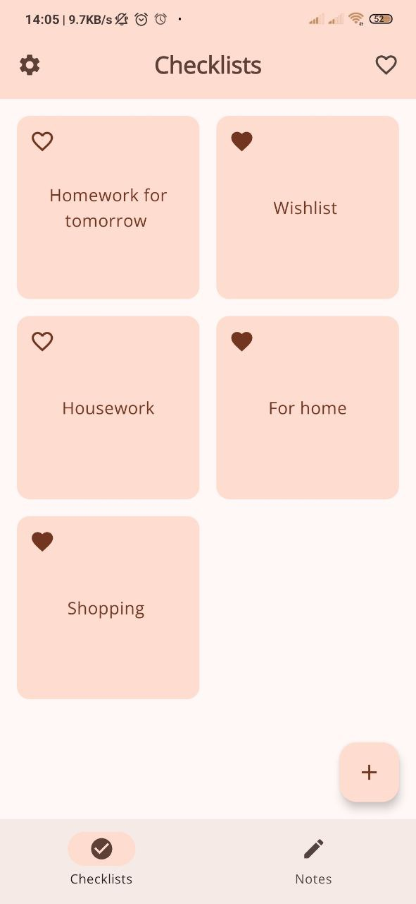
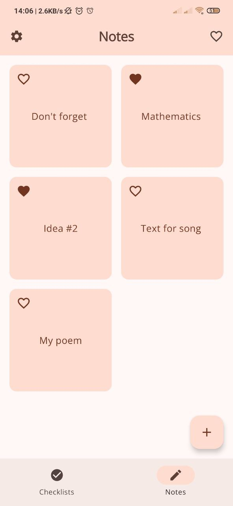
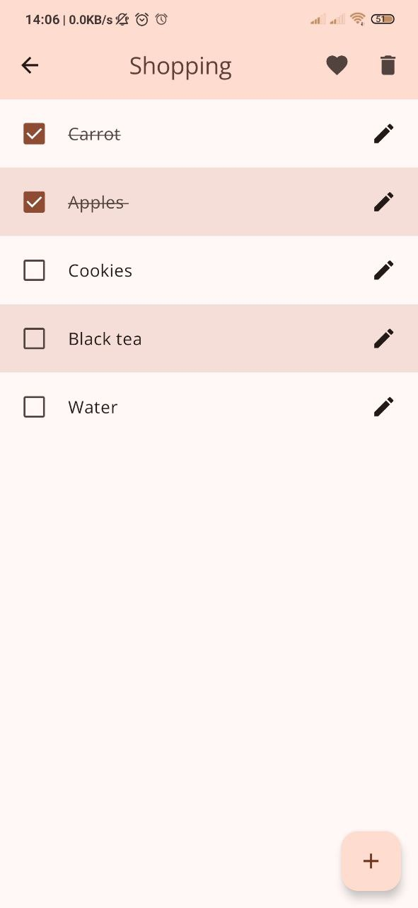
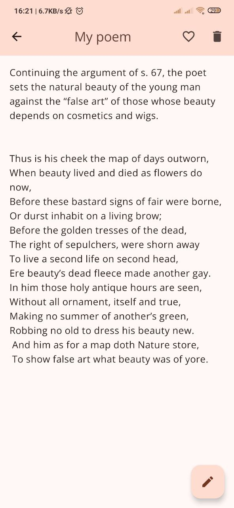
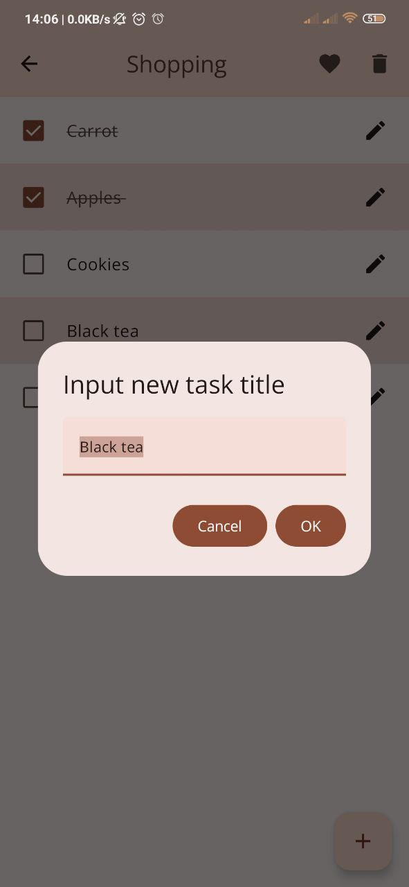
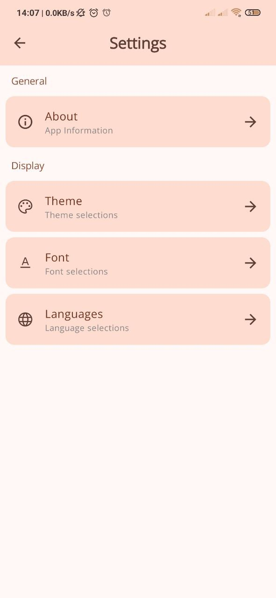
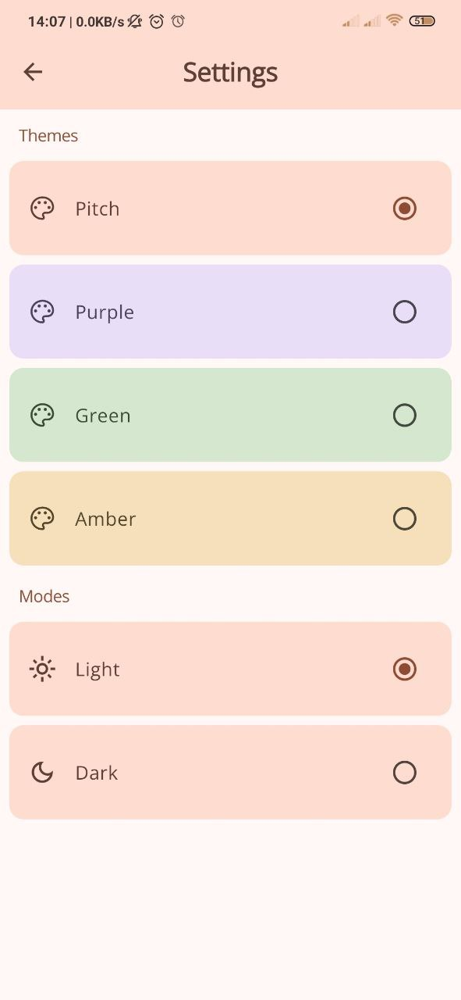
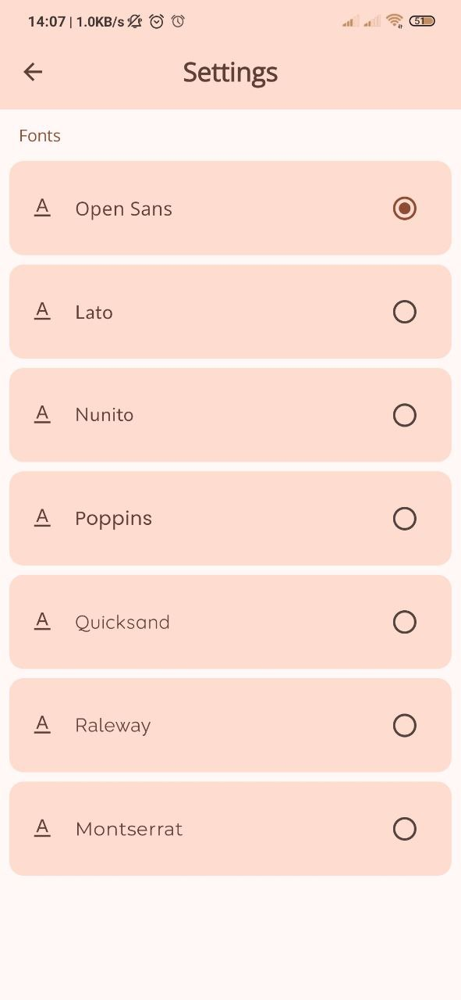
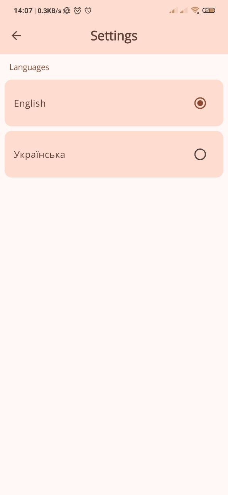

# 📱 MyNote

## 🎥 Demo

<details>
  <summary>Click to expand</summary>

  <div align="center">
    <table>
      <tr>
        <td></td>
        <td></td>
        <td></td>
      </tr>
      <tr>
        <td></td>
        <td></td>
        <td></td>
      </tr>
      <tr>
        <td></td>
        <td></td>
        <td></td>
      </tr>
    </table>
  </div>

</details>


---

## 📚 Description

**What is this app?**

MyNote is an application for managing personal tasks as notes and checklists. This app allows users to create, edit, and store notes and checklists while offering a wide range of customization options: users can adjust themes, toggle between light and dark modes, switch languages, and choose fonts.

**Why did I create this app?**

MyNote is an app that serves as my "learning sandbox" for experimenting with and testing various Android technologies. The project is designed to combine different tools and libraries to bring my learning closer to real-world projects.

**What problem does it solve?**

This app helps users efficiently organize their tasks, notes, and checklists in one place. By offering a structured and visually customizable environment, MyNote enhances productivity.

---

## ⚙️ Technologies Used
| Technology       | Usage                     |
|-----------------|--------------------------|
| **Kotlin**      | Main programming language |
| **Jetpack Compose** | UI components         |
| **Material 3**  | Design system             |
| **Hilt**        | Dependency Injection      |
| **MVVM**        | Architecture pattern     |
| **Room**        | Local database for users checklists and notes|
| **DataStore**   | For saving user preferences|
| **Coroutines**  | Asynchronous operations   |
| **Kotlin Flows**| Reactive programming      |
|**Jetpack's Navigation Component**| Navigations between screens|

---

## 🚀 Want to test it?

Now the project is at the closed testing stage on Google Play, we expect a soon release!
But for now, you can try it by installing the APK from release [here](https://github.com/Iezekiile/MyNotePP/releases/tag/v0.2). 

---
## ✅ Implemented Features
- [x] **Create and Edit Notes** – Users can create text-based notes and modify them anytime.
- [x] **Create and Manage Checklists** – Users can add checklists with tasks and interactive checkboxes.
- [x] **Light/Dark modes** – Light and dark mode switching for better user experience.
- [x] **Color theme Customization** - Customizable color themes to enhance user experience and personalization.
- [x] **Fonts Customizations** - Customizable font styles to improve readability and personalize the user interface.
- [x] **Localization selection** - Language localization with support for English and Ukrainian to cater to a wider audience.

## 🔧 Planned Features
- [ ] **Recycle Bin** - Temporary storage for deleted notes and checklists, allowing users to restore items within a defined period before permanent deletion.
- [ ] **Automatic Cloud Backup** - Сloud backup for user lists and checklists, ensuring data is automatically saved (few times a day) and securely stored for easy recovery at any time.
- [ ] **Dynamic Search** - Real-time search functionality to dynamically filter items by title, providing fast and accurate results as users type.
- [ ] **Voice Input** - Enable users to easily create notes and tasks by speaking, with automatic transcription and seamless integration into their checklists.
- [ ] **AI-Powered Checklist Creation** - Leverage AI to automatically convert user-provided text or audio into a structured checklist, generating task items and a relevant title based on the user's input.
 
---

## 🔜 Next for Refactoring
- [ ] **Theme choosing functional** - Standardize the name of the theme in the application code, convert it to enum as Fonts.
- [ ] ***Domain Layer** - Add a domain layer to reduce the dependencies of application layers
- [ ] **Clean architecture** - Rewrite code rewrite the code according to a clean architecture.
---

## 🎨 UI/UX Possible Improvements
- [ ] Add swipe for navigation between checklists and notes.
- [ ] Add rename function for items in home screen.
- [ ] Preview tasks in checklists from home screen.
- [ ] Add diferent sizes or forms for tiles in home screen.
- [ ] Add scroll bar for scrollable screens.
- [ ] Add the ability to set specific icons for tiles for better differentiation.
- [ ] Add a short onboarding during the first use.

---

## 🐞 Known Bugs
- [ ] When navigating with the settings screen, a double tap opens two screens - redo through isNavigating state.
- [ ] For a second, the default theme is visible on restart, it is probably worth adding Splash Screen.
- [ ] Bugs when changing the theme, sometimes main screen after restarting keep the old localization before recomposition

---

## 📜 License
```
MIT License

Copyright (c) 2025 Maksym Tsymbal

Permission is hereby granted, free of charge, to any person obtaining a copy
of this software and associated documentation files (the "Software"), to deal
in the Software without restriction, including without limitation the rights
to use, copy, modify, merge, publish, distribute, sublicense, and/or sell
copies of the Software, and to permit persons to whom the Software is
furnished to do so, subject to the following conditions:

The above copyright notice and this permission notice shall be included in all
copies or substantial portions of the Software.

THE SOFTWARE IS PROVIDED "AS IS", WITHOUT WARRANTY OF ANY KIND, EXPRESS OR
IMPLIED, INCLUDING BUT NOT LIMITED TO THE WARRANTIES OF MERCHANTABILITY,
FITNESS FOR A PARTICULAR PURPOSE AND NONINFRINGEMENT. IN NO EVENT SHALL THE
AUTHORS OR COPYRIGHT HOLDERS BE LIABLE FOR ANY CLAIM, DAMAGES OR OTHER
LIABILITY, WHETHER IN AN ACTION OF CONTRACT, TORT OR OTHERWISE, ARISING FROM,
OUT OF OR IN CONNECTION WITH THE SOFTWARE OR THE USE OR OTHER DEALINGS IN THE
SOFTWARE.
```

